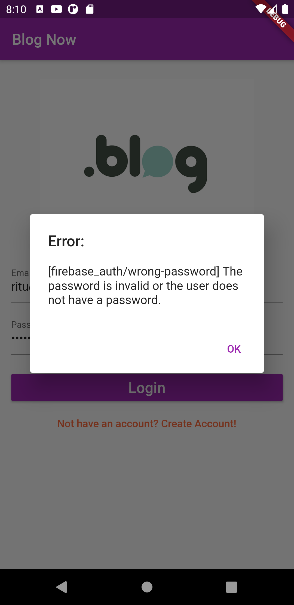
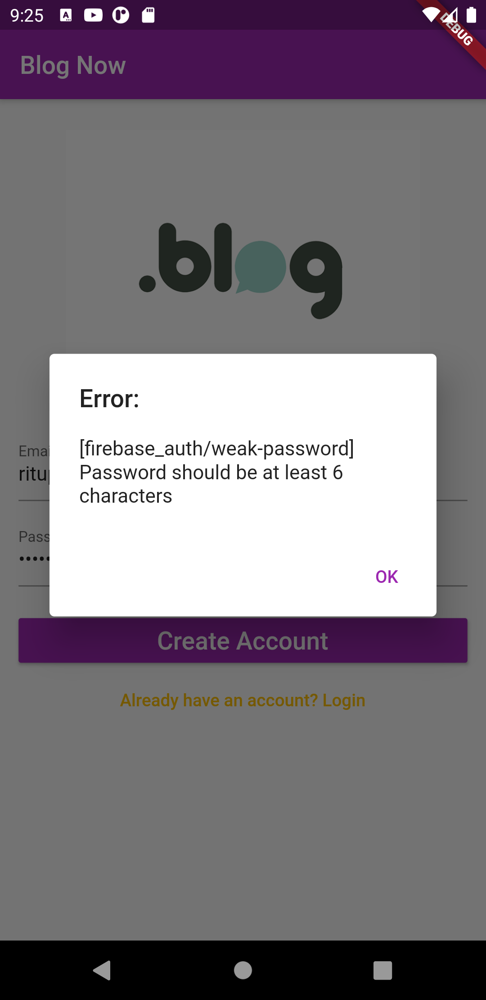
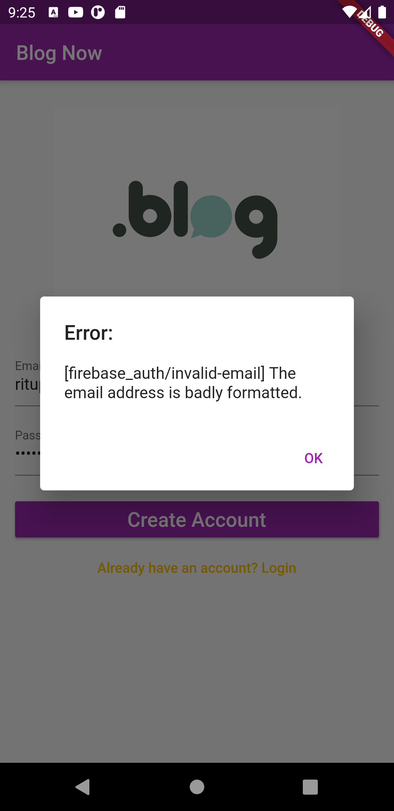
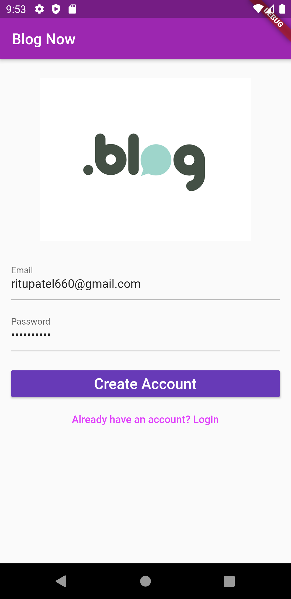
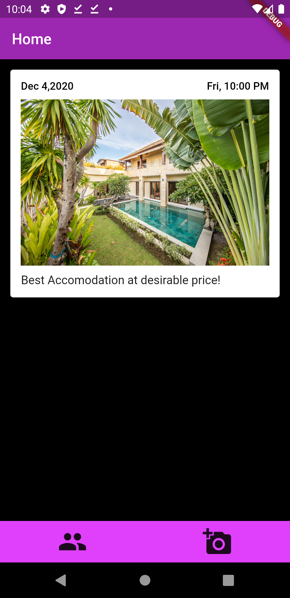
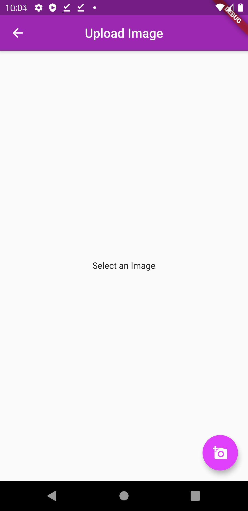
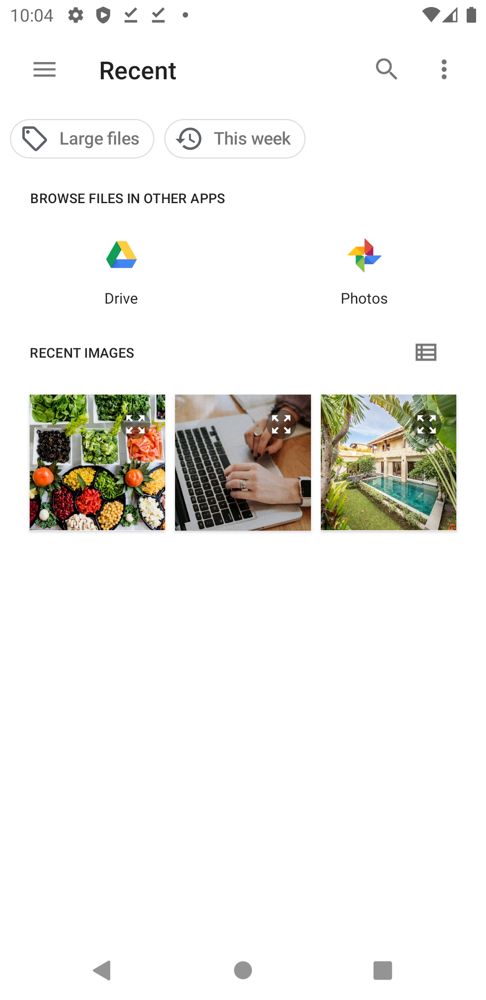
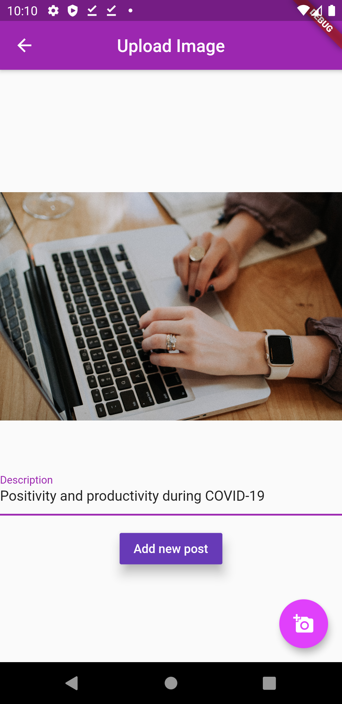
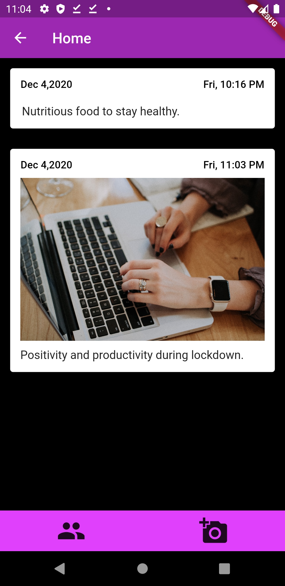

# blog_app

 This project is made by taking reference from [YouTube](https://www.youtube.com/watch?v=zu64GOm0KKU&list=PLxefhmF0pcPlw2kf-3PAPruUjqDYEEsRb).
(It required lot of changes to be done in order to work as expected).

#### This app is built using flutter and firebase(BAAS).
- It authenticates user.
- Validate inputs.
- Allow user to view and add new blogs.

#### Overview of app

 - ### Authentication using firebase 

 

 - ### Validation of user credentials

 &nbsp;   &nbsp;   
 

 - ### Add pictures from gallery
 
  &nbsp;   &nbsp;   &nbsp;   &nbsp;    
 
  &nbsp;   &nbsp;   
 
 
 - ## Note : Check the dependencies and thier version in pubspec.yaml file to get similar results. 
